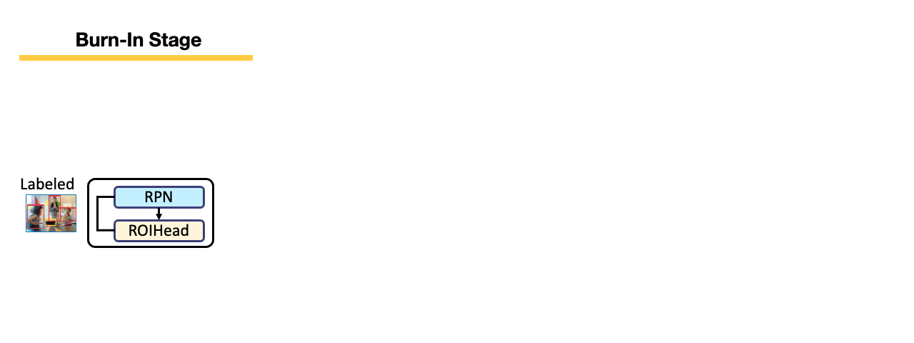

# Unbiased Teacher for Semi-Supervised Object Detection

 [](https://opensource.org/licenses/MIT)

This is the PyTorch implementation of our paper: <br>
**Unbiased Teacher for Semi-Supervised Object Detection**<br>
[Yen-Cheng Liu](https://ycliu93.github.io/), [Chih-Yao Ma](https://chihyaoma.github.io/), [Zijian He](https://research.fb.com/people/he-zijian/), [Chia-Wen Kuo](https://sites.google.com/view/chiawen-kuo/home), [Kan Chen](https://kanchen.info/), [Peizhao Zhang](https://scholar.google.com/citations?user=eqQQkM4AAAAJ&hl=en), [Bichen Wu](https://scholar.google.com/citations?user=K3QJPdMAAAAJ&hl=en), [Zsolt Kira](https://www.cc.gatech.edu/~zk15/), [Peter Vajda](https://sites.google.com/site/vajdap)<br>
International Conference on Learning Representations (ICLR), 2021 <br>

[[arXiv](https://arxiv.org/abs/2102.09480)] [[OpenReview](https://openreview.net/forum?id=MJIve1zgR_)] [[Project](https://ycliu93.github.io/projects/unbiasedteacher.html)]

<p align="center">

</p>

# Installation

## Prerequisites

- Linux or macOS with Python ≥ 3.6
- PyTorch ≥ 1.5 and torchvision that matches the PyTorch installation.

## Install PyTorch in Conda env

```shell
# create conda env
conda create -n detectron2 python=3.6
# activate the enviorment
conda activate detectron2
# install PyTorch >=1.5 with GPU
conda install pytorch torchvision -c pytorch
```

## Build Detectron2 from Source

Follow the [INSTALL.md](https://github.com/facebookresearch/detectron2/blob/master/INSTALL.md) to install Detectron2.

## Dataset download

1. Download COCO dataset

```shell
# download images
wget http://images.cocodataset.org/zips/train2017.zip
wget http://images.cocodataset.org/zips/val2017.zip

# download annotations
wget http://images.cocodataset.org/annotations/annotations_trainval2017.zip
```

2. Organize the dataset as following:

```shell
unbiased_teacher/
└── datasets/
    └── coco/
        ├── train2017/
        ├── val2017/
        └── annotations/
        	├── instances_train2017.json
        	└── instances_val2017.json
```

## Training

- Train the Unbiased Teacher under 1% COCO-supervision

```shell
python train_net.py \
      --num-gpus 8 \
      --config configs/coco_supervision/faster_rcnn_R_50_FPN_sup1_run1.yaml \
       SOLVER.IMG_PER_BATCH_LABEL 16 SOLVER.IMG_PER_BATCH_UNLABEL 16
```

- Train the Unbiased Teacher under 2% COCO-supervision

```shell
python train_net.py \
      --num-gpus 8 \
      --config configs/coco_supervision/faster_rcnn_R_50_FPN_sup2_run1.yaml \
       SOLVER.IMG_PER_BATCH_LABEL 16 SOLVER.IMG_PER_BATCH_UNLABEL 16
```

- Train the Unbiased Teacher under 5% COCO-supervision

```shell
python train_net.py \
      --num-gpus 8 \
      --config configs/coco_supervision/faster_rcnn_R_50_FPN_sup5_run1.yaml \
       SOLVER.IMG_PER_BATCH_LABEL 16 SOLVER.IMG_PER_BATCH_UNLABEL 16
```

- Train the Unbiased Teacher under 10% COCO-supervision

```shell
python train_net.py \
      --num-gpus 8 \
      --config configs/coco_supervision/faster_rcnn_R_50_FPN_sup10_run1.yaml \
       SOLVER.IMG_PER_BATCH_LABEL 16 SOLVER.IMG_PER_BATCH_UNLABEL 16
```

- Train the Unbiased Teacher under VOC07 (as labeled set) and VOC12 (as unlabeled set)

```shell
python train_net.py \
      --num-gpus 8 \
      --config configs/voc/voc07_voc12.yaml \
       SOLVER.IMG_PER_BATCH_LABEL 8 SOLVER.IMG_PER_BATCH_UNLABEL 8
```

- Train the Unbiased Teacher under VOC07 (as labeled set) and VOC12+COCO20cls (as unlabeled set)

```shell
python train_net.py \
      --num-gpus 8 \
      --config configs/voc/voc07_voc12coco20.yaml \
       SOLVER.IMG_PER_BATCH_LABEL 8 SOLVER.IMG_PER_BATCH_UNLABEL 8
```

## Resume the training

```shell
python train_net.py \
      --resume \
      --num-gpus 8 \
      --config configs/coco_supervision/faster_rcnn_R_50_FPN_sup10_run1.yaml \
       SOLVER.IMG_PER_BATCH_LABEL 16 SOLVER.IMG_PER_BATCH_UNLABEL 16 MODEL.WEIGHTS <your weight>.pth
```

## Evaluation

```shell
python train_net.py \
      --eval-only \
      --num-gpus 8 \
      --config configs/coco_supervision/faster_rcnn_R_50_FPN_sup10_run1.yaml \
       SOLVER.IMG_PER_BATCH_LABEL 16 SOLVER.IMG_PER_BATCH_UNLABEL 16 MODEL.WEIGHTS <your weight>.pth
```

## Model Weights

For the following COCO-supervision results, we use 16 labeled images + 16 unlabeled images on 8 GPUs (single node).

Faster-RCNN:

|  Model  | Supervision |        Batch size         |  AP   |                                       Model Weights                                        |
| :-----: | :---------: | :-----------------------: | :---: | :----------------------------------------------------------------------------------------: |
| R50-FPN |     1%      | 16 labeled + 16 unlabeled | 20.16 | [link](https://drive.google.com/file/d/1NQs5SrQ2-ODEVn_ZdPU_2xv9mxdY6MPq/view?usp=sharing) |
| R50-FPN |     2%      | 16 labeled + 16 unlabeled | 24.16 | [link](https://drive.google.com/file/d/12q-LB4iDvgXGW50Q-bYOahpalUvO3SIa/view?usp=sharing) |
| R50-FPN |     5%      | 16 labeled + 16 unlabeled | 27.84 | [link](https://drive.google.com/file/d/1IJQeRP9wHPU0J27YTea-y3lIW96bMAUu/view?usp=sharing) |
| R50-FPN |     10%     | 16 labeled + 16 unlabeled | 31.39 | [link](https://drive.google.com/file/d/1U9tnJGvzRFSOnOfIHOnelFmlvEfyayha/view?usp=sharing) |

For the following VOC results, we use 8 labeled images + 8 unlabeled images on 4 GPUs (single node).

VOC:

|  Model  | Labeled set |  Unlabeled set  |       Batch size        | AP50  |  AP   |                                        Model Weights                                         |
| :-----: | :---------: | :-------------: | :---------------------: | :---: | :---: | :------------------------------------------------------------------------------------------: |
| R50-FPN |    VOC07    |      VOC12      | 8 labeled + 8 unlabeled | 80.51 | 54.48 | [link](https://drive.google.com/drive/folders/1Wo7wGZ2t2sLLJ-HmZ46YOeopPwDwHYPL?usp=sharing) |
| R50-FPN |    VOC07    | VOC12+COCO20cls | 8 labeled + 8 unlabeled | 81.71 | 55.79 | [link](https://drive.google.com/drive/folders/1xSY6nTX2n3RzuTw7dOQ_022RRHffJEPP?usp=sharing) |

## FAQ

1. Q: Using the lower batch size and fewer GPUs cannot achieve the results presented in the paper?

- A: We train the model with 32 labeled images + 32 unlabeled images per batch for the results presented in the paper, and using the lower batch size leads to lower accuracy. For example, in the 1% COCO-supervision setting, the model trained with 16 labeled images + 16 unlabeled images achieves 20.16 AP as shown in the following table.

|   Experiment GPUs    |    Batch size per node    |        Batch size         |  AP   |
| :------------------: | :-----------------------: | :-----------------------: | :---: |
| 8 GPUs/node; 4 nodes |  8 labeled + 8 unlabeled  | 32 labeled + 32 unlabeled | 20.75 |
| 8 GPUs/node; 1 node  | 16 labeled + 16 unlabeled | 16 labeled + 16 unlabeled | 20.16 |

1. Q: How to use customized dataset other than COCO and VOC?

- A: Check [issue #10](https://github.com/facebookresearch/unbiased-teacher/issues/10). [Vladimir Fomenko](https://github.com/vlfom) provides a great answer!

3. Q: What is `COCO_supervision.txt`? Could I remove it if I need to use my own dataset?

- A: `COCO_supervision.txt` stores data split of the results we presented in the paper. We did this to make sure the results are reproducible. Also, we found out that the variance across runs is less than 1 mAP, so using other random seed should lead to similar results.

4. Why VOC results in github repo look better than VOC results presented in the paper?

- A: We use COCOevaluator to evalute VOC07-test on paper, while we notice that VOCevaluator has different way to compute AP and results in higher results.

## Citing Unbiased Teacher

If you use Unbiased Teacher in your research or wish to refer to the results published in the paper, please use the following BibTeX entry.

```BibTeX
@inproceedings{liu2021unbiased,
    title={Unbiased Teacher for Semi-Supervised Object Detection},
    author={Liu, Yen-Cheng and Ma, Chih-Yao and He, Zijian and Kuo, Chia-Wen and Chen, Kan and Zhang, Peizhao and Wu, Bichen and Kira, Zsolt and Vajda, Peter},
    booktitle={Proceedings of the International Conference on Learning Representations (ICLR)},
    year={2021},
}
```

Also, if you use Detectron2 in your research, please use the following BibTeX entry.

```BibTeX
@misc{wu2019detectron2,
  author =       {Yuxin Wu and Alexander Kirillov and Francisco Massa and
                  Wan-Yen Lo and Ross Girshick},
  title =        {Detectron2},
  howpublished = {\url{https://github.com/facebookresearch/detectron2}},
  year =         {2019}
}
```

## License

This project is licensed under [MIT License](LICENSE), as found in the LICENSE file.
